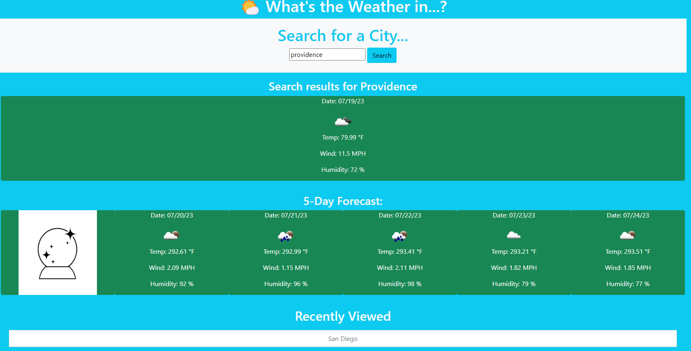

# Weather App

## Activity

- I have created a Weather App that gets the current weather as well as the 5 day forecast for that city.
- Users can see the temperature, wind speed, and humidity as well as a visual representation of the weather for that day.
- I have used OpenWeather API and DayJS to help populate the web app.

## User Instructions

- Type a city in the input field and hit search.
- Weather for that current city as well as a 5 day forecast will populate below.

## Screenshot

- Here is a screenshot of the working webpage.

## Working Code

- Here is a link to a working version of my code:
[Weather App](https://laurbaur024.github.io/weather-app/)